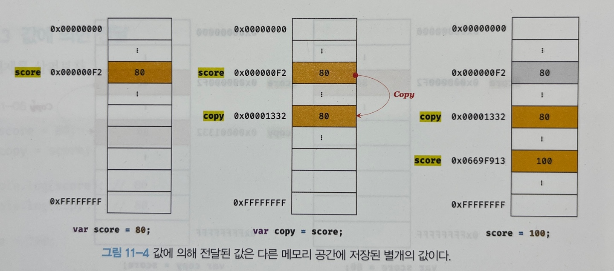
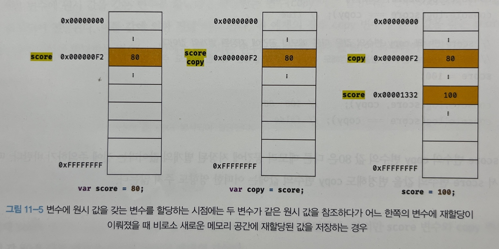

# 📕 11장 원시 값과 객체의 비교

JS에서 제공하는 7가지 데이터 타입은 크게 **원시 타입**, **객체 타입**으로 구분할 수 있다.

#### 💡원시 타입과 객체 타입의 차이점

⚙️ 변경 가능? 불가능?

- 원시 타입 -> 변경 불가능한 값
- 객체 타입 -> 변경 가능한 값

⚙️ 값의 저장?

- 원시 타입 -> 변수에 할당하면 실제 값이 저장된다.
- 객체 타입 -> 변수에 할당하면 참조 값이 저장된다.

⚙️ 다른 변수에 할당?

- 원시 타입 -> 원본의 원시 값이 복사되어 전달된다. === 값에 의한 전달
- 객체 타입 -> 원본의 참조 값이 복사되어 전달된다. === 참조에 의한 전달

## 📝 11.1 원시 값

### ✏️ 11.1.1 변경 불가능한 값

원시 타입의 값은 읽기 전용 값으로서 변경이 불가능하다.

- 변경 불가능한 것은 변수가 아니라 값에 대한 진술이다. -> 변수 값은 변경할 수 있다.
- 어떤 일이 있어도 불변하는 원시 타입의 특성이 데이터의 신뢰성을 보장한다.
- 상수는 변경이 불가능한 값이 아니라 재할당이 불가능한 값이다. (`const`)
- 원시 값이 할당되어 있는 변수에 다른 값을 할당하면 원시 값을 변경하는 것이 아니라 새로운 메모리 공간에 값을 저장하고 변수가 참조하는 값의 주소가 변경된다는 것을 기억하자. -> **불변성**
- 불변성을 갖는 원시 값을 할당한 변수는 재할당 이외에 변수 값을 변경할 수 있는 방법이 없다.
- 원시 타입의 값을 변경할 수 있다면 예기치 않게 값이 변경될 수 있어 상태 변경을 추적하기 어렵게 만든다.


### ✏️ 11.1.2 문자열과 불변성

원시 값을 저장하기 위해서는 먼저 메모리 공간을 크기를 정해야 한다. 하지만 문자열은 다른 원시 타입과 다르게 문자 하나당 메모리 공간을 차지한다. 따라서 문자의 개수에 따라서 확보해야 하는 메모리 공간의 크기가 달라진다. (문자당 2비트의 공간이 필요)

- 문자열은 유사 배열 객체이면서 이터러블이므로 배열과 유사하게 각 문자에 접근할 수 있다.
- 인덱스로 각 문자에 접근할 수 있고 length를 갖기 때문에 for 문으로 순회할 수 있다.
- 값은 변경할 수 없지만 변수에 새로운 문자열을 재할당할 수 있다.(기존 문자열을 변경하지 않기 때문)

```js
let str = "string";

str[0] = "S";

console.log(str); // "string"
```

### ✏️ 11.1.3 값에 의한 전달

```js
let score = 100;
let copy = score;

console.log(score, copy); // 100, 100

score = 200;

console.log(score, copy); // 200, 100
```

변수2에 변수1을 할당하면 변수1의 값이 복사되어 변수2에 할당된다. 이를 값의 의한 전달이라 한다. 두 변수가 같은 값을 보유하고 있지만 둘은 다른 메모리를 보유하고 있는 별개의 값으로 변수1을 새로운 값으로 재할당해도 변수2의 값은 변하지 않는다. (원시 값을 가지는 변수)



ECMAScript 사양에는 변수를 통해 메모리에 어떻게 관리해야 하는지 명확하게 정의되어 있지 않다. 따라서 실제 JS엔진을 구현하는 제조사에 따라 내부 동작 방식은 미묘한 차이가 있을 수 있다.



파이썬의 경우 위 사진처럼 원시 값을 갖는 변수를 할당하면 두 변수가 같은 메모리를 참조하다가 한쪽의 변수에 재할당이 이루어졌을 때 새로운 메모리 공간에 재할당된 값을 저장하도록 동작한다.

"값에 의한 전달", "참조에 의한 전달"이라는 언어는 타 언어에서 자주 사용하지만 ECMASctipt 사양에는 등장하지 않는다.

- "값에 의한 전달", "참조에 의한 전달"은 "공유에 의한 전달"이라고 표현하는 경우도 있다. (모두 JS를 위한 용어가 아님)
- 엄격하게 표현하자면 변수에는 값이 전달되는 것이 아니라 메모리 주소가 전달되는 것이다.
- 변수와 같은 식별자는 값이 아니라 메모리 주소를 기억한다.
- "값에 의한 전달"도 사실은 값을 전달하는 것이 아니라 메모리 주소를 전달한다.
- 전달된 메모리 주소를 통해 메모리 공간에 접근하면 값을 참조할 수 있다.
- 변수에 원시 값을 갖는 변수를 할당하면 결국 두 변수의 원시 값은 서로 다른 메모리 공간에 저장된 별개의 값이 되어 어느 한쪽에서 재할당을 통해 값을 변경하더라도 서로 간섭할 수 없다.
