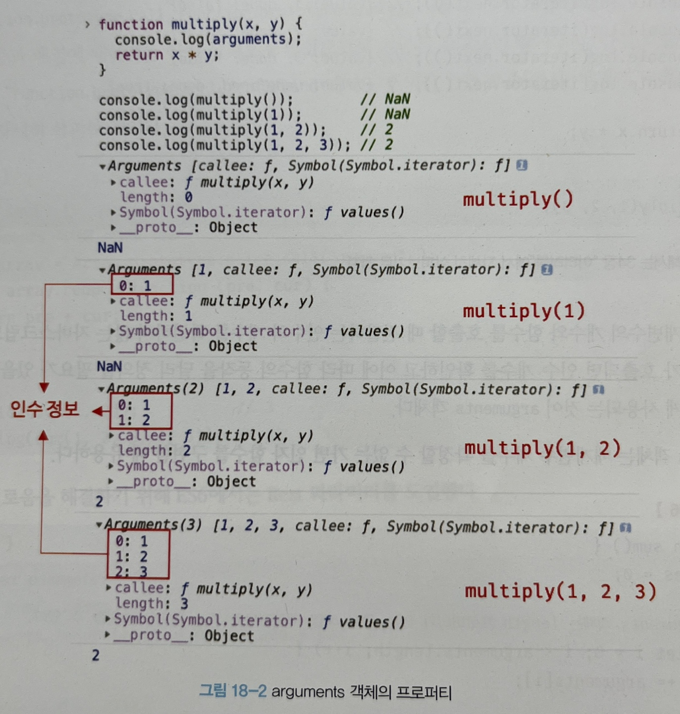

# 📕 18장 함수와 일급 객체

## 📝 18.1 일급 객체

일급 객체의 조건 (JS의 함수는 아래 조건을 모두 만족한다)

- 무명의 리터럴로 생성할 수 있다. -> 런타임에 생성이 가능하다.
- 변수나 자료구조(객체, 배열 등)에 저장할 수 있다.
- 함수의 매개변수에 전달할 수 있다.
- 함수의 반환값으로 사용할 수 있다.

함수가 일급 객체라는 것은 객체와 동일하게 사용할 수 있다는 것을 의미한다. 값처럼 사용이 가능하고 런타임에 함수 객체로 평가된다. 또 함수의 매개변수로 전달할 수 있고, 함수의 반환값으로 사용할 수 있다. 이는 함수형 프로그래밍을 가능케 하는 JS의 장점 중 하나다.

일반 객체와의 차이점은 일반 객체는 호출할 수 없고 함수는 호출할 수 있다.

## 📝 18.2 함수 객체의 프로퍼티

함수 객체는 고유의 프로퍼티로 `arguments`, `caller`, `length`, `name`, `prototype`를 가진다.

`__proto__`는 함수 객체 고유의 프로퍼티가 아닌 `Object.prototype` 객체의 프로퍼티를 상속받은 것이다.

### ✏️ 18.2.1 arguments 프로퍼티

`arguments` 프로퍼티 값은 `arguments` 객체로 함수 호출 시 전달된 인수의 정보를 담고 있는 순회 가능한 유사 배열 객체이다. 또한 함수 내부에서 지역 변수처럼 사용되며 외부에서 참조할 수 없다.



- 해당 프로퍼티는 현재 일부 브라우저에서 지원하지만 ES3부터 표준에서 폐지되었다.
- JS 엔진은 함수의 매개변수와 인수의 개수가 일치하는지 확인하지 않아서 전달된 인수의 개수가 달라도 에러가 발생하지 않는다.
- 매개변수는 함수 몸체 내부에서 지역 변수처럼 사용되어 함수가 호출되면 암묵적으로 선언되고 `undefined`로 초기화된 이후 인수가 할당된다.
- 매개변수보다 많은 인수를 전달하면 초과된 인수는 무시되지만 버려지는 것이 아니라 `arguments` 객체의 프로퍼티로 보관된다.
- `callee` 프로퍼티는 호출되어 `arguments` 객체를 생성한 함수를 가리킨다.
- `length` 프로퍼티는 인수의 개수를 가리킨다.
- `Symbol` 프로퍼티는 `arguments` 객체를 순회 가능한 이터러블로 만들기 위한 프로퍼티다.

선언된 매개변수의 개수와 전달된 인수의 개수가 맞는지 비교할 때 `arguments` 객체를 사용할 수 있고 매개변수 개수를 확정할 수 없는 **가변 인자 함수**를 구현할 때 유용하다. (`arguments`가 유사배열 객체여서 가능)

```js
function sum() {
  let result = 0;

  for (let i = 0; i < arguments.length; i++) {
    result += arguments[i];
  }

  return result;
}

sum(1, 10); // 11
sum(1, 20); // 21
sum(10, 10); // 20
```

유사 배열 객체는 배열이 아니기 때문에 배열 메서드를 사용하면 에러가 발생한다. 배열 메서드를 사용하기 위해서는 `Function.prototype.call/apply/bind`를 사용해 간접 호출해야 하는 번거로움이 있었지만 ES6에서 도입된 `Rest` 파라미터를 이용해 해결할 수 있다. `Rest` 파라미터의 도입 이후 `arguments`의 중요성이 많이 낮아졌다.

```js
function sum() {
  const array = Array.prototype.slice.call(arguments);
  return array.reduce((pre, cur) => {
    return pre + cur;
  }, 0);
}

// Rest 파라미터
function sum(...args) {
  return args.reduce((pre, cru) => pre + cur, 0);
}
```

### ✏️ 18.2.2 caller 프로퍼티

함수 자신을 호출한 함수를 가리킨다.

- 비표준 프로퍼티이며 표준화될 예정이 없다.
- 브라우저에서 실행한 결과와 Node 환경에서 실행한 결과가 다르다.

```js
function foo(func) {
  return func();
}

function boo() {
  return `caller: ${boo.caller}`;
}

foo(boo); // caller : function foo(func) {...}
boo(); // caller : null
```

### ✏️ 18.2.3 length 프로퍼티

함수를 정의할 때 선언한 매개변수의 개수를 가리킨다. `arguments`의 `length`는 인수의 개수를 가리키는 다른 프로퍼티다.

```js
function foo() {}
console.log(foo.length); // 0

function foo(x, y) {}
console.log(foo.length); // 2

function foo(x, y, z) {}
console.log(foo.length); // 3
```

### ✏️ 18.2.4 name 프로퍼티

함수의 이름을 나타내는 프로퍼티로 ES6에서 정식 표준이 되었다. 익명 함수의 경우 ES5에서는 빈 문자열을 갖지만 ES6에서는 함수 객체를 가리키는 식별자를 값으로 갖는다.

```js
// 기명
const namedFunc = function foo() {};
console.log(namedFunc.name); // foo

// 익명
const anonymousFunc = function () {};
// ES5 빈문자열
// ES6 함수 객체를 가리키는 변수 이름
console.log(anonymousFunc.name); // anonymousFunc

// 함수 선언문
function bar() {}
console.log(bar.name); // bar
```

### ✏️ 18.2.5 `__proto__` 접근자 프로퍼티

모든 객체는 [[Prototype]]이라는 내부 슬롯을 갖는다. 해당 내부 슬롯은 객체지향 프로그래밍의 상속을 구현하는 프로토타입 객체를 가리킨다.

`__proto__` 프로퍼티는 [[Prototype]] 내부 슬롯이 가리키는 프로토타입 객체에 접근하기 위해 사용하는 객체인데 직접 접근할 수 없고 간접적으로 프로토타입 객체에 접근할 수 있다.

### ✏️ 18.2.6 prototype 프로퍼티

함수가 생성자 함수로 호출될 때 생성할 인스턴스의 프로토타입 객체를 가리킨다.

- `constructor`만이 소유하는 프로퍼티다.
