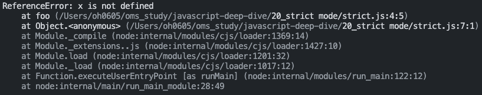

# 📕 20장 strict mode

## 📝 20.1 strict mode란?

```js
function foo() {
  x = 10;
}

foo();

console.log(x); // 10
```

위 예시 코드를 보면 `foo` 함수 내부에서는 선언되지 않은 변수 `x`를 할당하고 있고, 전역에서는 `x`를 참조하고 있다. 이때 js는 스코프 체인을 통해서 `x`를 찾기 시작하는데 처음에 foo에서 `x`를 검색해 찾지 못하면 상위 스코프(전역)으로 이동하여 `x`를 검색한다. 전역에서도 `x`가 존재하지 않기 때문에 `ReferenceError`를 발생시킬 것 같지만 JS가 `암묵적 전역`으로 전역 객체에 `x`를 동적 생성하여 전역 변수처럼 사용할 수 있다.

개발자의 의도와 상관없이 발생한 암묵적 전역은 오류를 발생할 원인이 될 가능성이 크기 때문에 반드시 `let`, `var`, `const` 키워드를 사용해 변수를 선언하고 사용해야 한다.  
이러한 문제 외에도 오타나 문법적 오류로 인한 실수는 언제나 발생할 수 있어 안정적인 코드를 생산하기 위해서 근본적인 해결이 필요하다. -> **개발 환경 세팅**  
이를 위해서 ES5부터 `strict mode`가 추가되었고 `Eslint`를 이용해도 `strict mode`와 유사한 효과를 얻을 수 있다. -> `Eslint`는 `strict mode`의 효과에 더해 코딩 컨벤션을 정의해 강제할 수 있다.

## 📝 20.2 strict mode의 적용

전역의 선두 혹은 함수 몸체의 선두에 `'use strict';`를 추가해 `strict mode`를 사용할 수 있다.

```js
'use strict';

function foo() {
  x = 10;
}

foo();
```



## 📝 20.3 전역에 strict mode를 적용하는 것은 피하자

전역에 적용한 `strict mode`는 스크립트 단위로 적용된다.

```html
<!DOCTYPE html>
<html>
  <body>
    <script>
      'use strict';
      x = 10; // ReferenceError
    </script>
    <script>
      y = 10; // 에러가 발생하지 않는다.
    </script>
  </body>
</html>
```

- `strict mode`는 스크립트 단위로 적용되기 때문에 다른 스크립트에 영향을 주지 않는다.
- `strict mode`와 `non-strict mode`를 혼용해서 사용하는 것은 오류를 발생시킬 수 있다.
- 서드파티 라이브러리를 사용하는 경우 `non-strict mode`인 경우가 있어 전역 `strict mode`를 적용하는 것은 바람직하지 않다.

  - 이러한 경우 즉시 실행 함수로 스크립트 전체를 감싸 스코프를 구분하고 즉시 실행 함수 선두에 `strict mode`를 적용한다.

  ```js
  (function () {
    'use strict';

    /// Do something...
  })();
  ```
